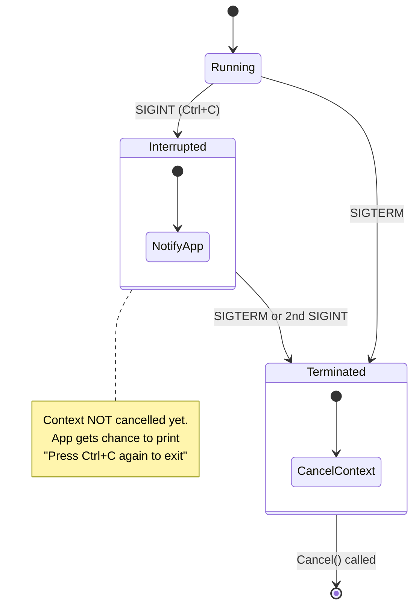
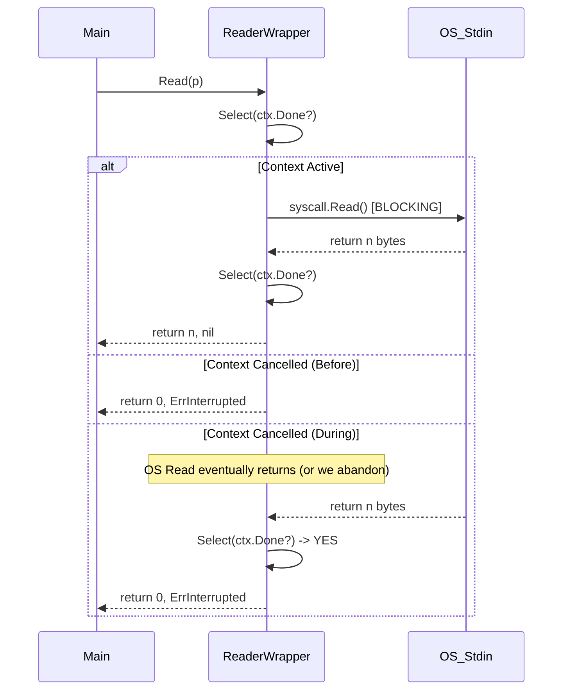

# Technical Architecture

## Overview

`lifecycle` manages the interaction between OS signals, Context cancellation, and blocking I/O calls.

## Patterns

### 1. Dual Signal Context (`pkg/signal`)

Unlike `signal.NotifyContext` (stdlib) which cancels immediately on any signal, our `SignalContext` implements a specific state machine for interactive CLIs.

### 2. Interruptible I/O (`pkg/termio`)

Go's `io.Reader` is blocking. We cannot easily kill a thread blocked on a syscall. `InterruptibleReader` solves this by using a "Peek & Abandon" strategy.

### 3. Runtime Management (`pkg/runtime`)

Ensures process lifecycle is deterministic.

* **Timeouts**: `BlockWithTimeout` enforces deadlines on Shutdown phases. This prevents "Cleanup Zombie" states where a CLI hangs forever waiting for a database close or log flush.

### 4. Upgrade Terminal

We expose `UpgradeTerminal(io.Reader)` to allow arbitrary readers (e.g. from `os.Stdin` in a CLI framework) to be checked and "upgraded" to a platform-safe reader if they represent a terminal.

## Windows `CONIN$`

On **Windows**, `os.Stdin` is a wrapper around a Handle. If that Handle is in a blocking Read, standard Windows signals might not propagate correctly to the Go runtime in console applications.
Using `CONIN$` ensures we are talking directly to the Console Input buffer, which allows `Ctrl+C` events to bypass the blocking Read and trigger the `pkg/signal` handler.
