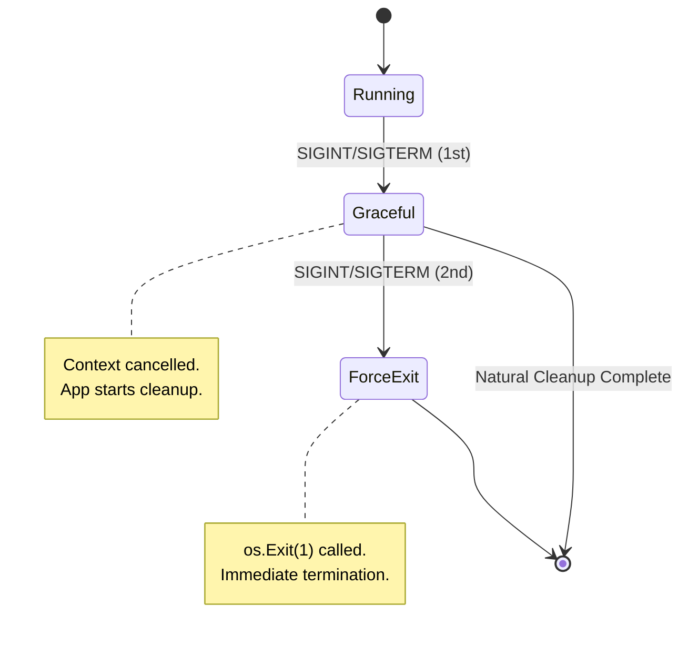
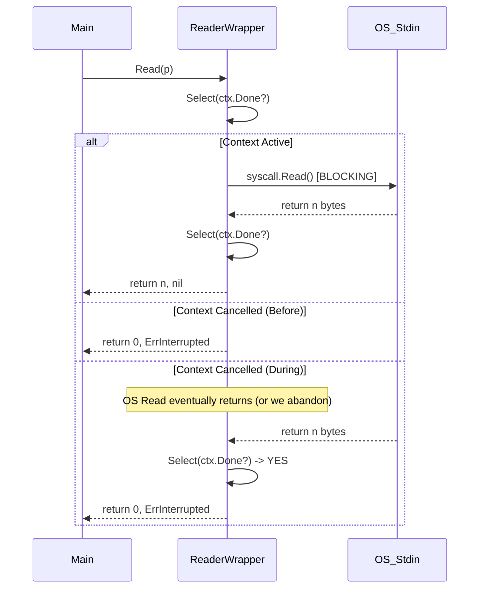
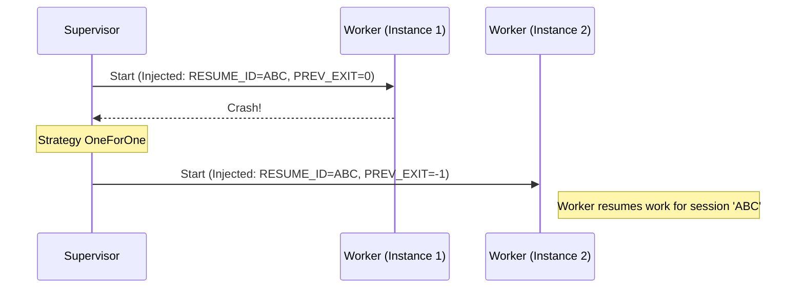
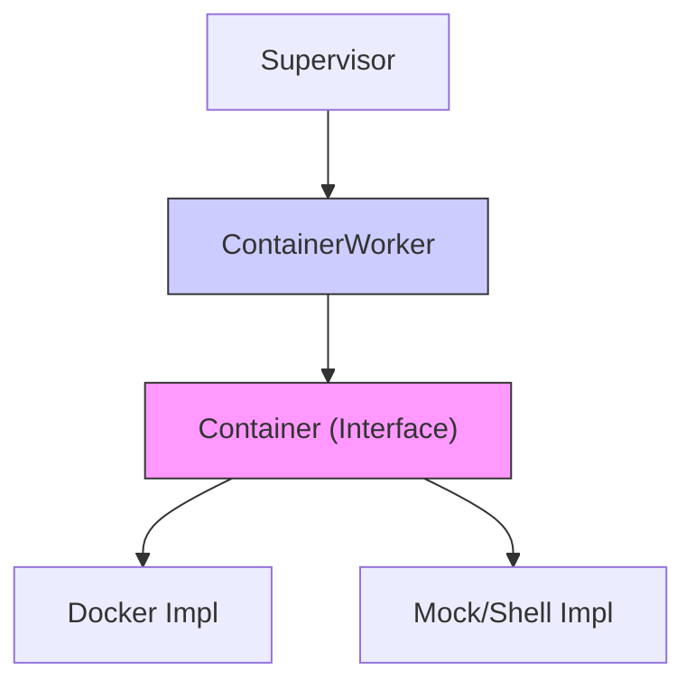

# Technical Architecture

## Overview

`lifecycle` manages the interaction between OS signals, Context cancellation, and blocking I/O calls.

## Patterns

### 1. Robust Signal Context (`pkg/signal`)

Our `SignalContext` manages the transition from Graceful to Forced shutdown, essential for interactive CLIs.



**Key Features:**

* **Functional Options**: Customize if `SIGINT` cancels or the number of signals for `ForceExit`.
* **Zero Leak**: monitoring goroutine is cleaned up via `.Stop()`.
* **Lifecycle Hooks**: Supports `OnShutdown` callbacks executed in LIFO order (defer-like) upon signal reception.

#### Execution Flow

```mermaid
sequenceDiagram
    participant OS
    participant SignalContext
    participant Hook_B
    participant Hook_A
    participant App

    OS->>SignalContext: SIGTERM
    SignalContext->>App: Cancel Context (ctx.Done closed)
    
    rect rgb(30, 30, 30)
        note right of SignalContext: Async Cleanup (LIFO)
        SignalContext->>Hook_B: Execute()
        Hook_B-->>SignalContext: Return
        SignalContext->>Hook_A: Execute()
        Hook_A-->>SignalContext: Return (or Panic recovered)
    end
```



### 2. Interruptible I/O (`pkg/termio`)

Go's `io.Reader` is blocking. We cannot easily kill a thread blocked on a syscall. `InterruptibleReader` solves this by using a "Peek & Abandon" strategy.



#### Caveats & Constraints

* **Data Loss (Peek & Abandon)**: If a read returns exactly as the context is cancelled, the bytes consumed from the OS buffer are **discarded** to prioritize the error. This is acceptable for interactive CLIs but risky for binary streams.
* **Blocking Syscalls**: Go cannot interrupt a raw `read()` syscall. The `Reader` remains blocked in the OS until data arrives, even if the user receives `ErrInterrupted`.
* **Buffer Inconsistency**: Sharing the underlying `io.Reader` between multiple `InterruptibleReader` instances leads to non-deterministic data theft.

#### Windows `CONIN$`

On **Windows**, `os.Stdin` is a wrapper around a Handle. If that Handle is in a blocking Read, standard Windows signals might not propagate correctly to the Go runtime in console applications.
Using `CONIN$` ensures we are talking directly to the Console Input buffer, which allows `Ctrl+C` events to bypass the blocking Read and trigger the `pkg/signal` handler.

### 3. Process Hygiene (`pkg/proc`)

Ensures that child processes do not outlive the parent (preventing "Zombies"), essential for managing Language Servers or background tools. We follow a **Fail-Closed** principle: if a process cannot be safely managed by the OS hygiene (e.g., job assignment failure), it is immediately killed to prevent leaks.

* **Linux**: Uses `SysProcAttr.Pdeathsig` to signal the child when the parent thread dies.
* **Windows**: Uses **Job Objects** (`JOB_OBJECT_LIMIT_KILL_ON_JOB_CLOSE`) to ensure the OS terminates the child tree when the parent handle is closed.

### 4. Runtime Management (`pkg/runtime`)

Ensures process lifecycle is deterministic.

* **Timeouts**: `BlockWithTimeout` enforces deadlines on Shutdown phases. This prevents "Cleanup Zombie" states where a CLI hangs forever waiting for a database close or log flush.

### 5. Observability (`pkg/log` & `pkg/metrics`)

The library is instrumented for production visibility without external dependencies.

* **Structured Logging**: Uses Go 1.21 `slog`. Users can inject custom loggers via `lifecycle.SetLogger`.
* **Decoupled Metrics**: A `Provider` interface allows users to bridge lifecycle events to Prometheus or OTEL.
  * **Signals**:
    * `IncSignalReceived(signal string)`: Counter of OS signals received.
  * **Processes** (`pkg/proc`):
    * `IncProcessStarted()`: Counter of child processes managed.
    * `IncProcessFailed()`: Counter of process start failures.
  * **Terminal** (`pkg/termio`):
    * `IncTerminalUpgrade(success bool)`: Counter of stdin upgrades (e.g. to CONIN$).
  * **Hooks** (`pkg/signal`):
    * `IncHookExecuted()`: Counter of successfully completed hooks.
    * `IncHookPanicked()`: Counter of hooks that panic (and recovered).
    * `ObserveHookDuration(duration)`: Histogram/Timer of hook execution time.
  * **Workers** (`pkg/worker`):
    * `IncWorkerStarted(type)`: Counter of workers started.
    * `IncWorkerStopped(type)`: Counter of workers stopped gracefully.
    * `IncWorkerFailed(type)`: Counter of worker failures.
    * `ObserveWorkerDuration(type, duration)`: Histogram of worker lifespan.
* **LogProvider**: Special provider that redirects metrics to debug logs for local verification.

### 6. Safety Mechanisms

* **Stalled Hook Detection**: Each hook is monitored by a timer (configurable via `WithHookTimeout`). If it exceeds the threshold (default 5s), a warning is logged.
* **Panic Recovery**: Hooks are wrapped in `recover()` to ensure a single faulty hook does not prevent others from running.

### 7. Introspection & Visualization (`pkg/signal` & `pkg/worker`)

To support tooling and better stewardship, we adopt an **Introspection Pattern**: components expose their configuration state as immutable DTOs (Data Transfer Objects). This decouples the internal logic from external representation.

* **Signal Context State**: `SignalContext` exposes a `State()` method returning its current configuration.
  * **MermaidRenderer**: `MermaidState(State)` generates a **State Diagram** (FSM) of the lifecycle policy.
* **Worker State**: All workers implement `State()` returning a recursive snapshot.
  * **MermaidTree(State)**: Generates a **Toplogical/Tree** diagram (`graph TD`) of the supervision tree.
  * **MermaidState(State)**: Generates a **Lifecycle/FSM** diagram (`stateDiagram-v2`) for individual workers.

These are exposed at the top-level via `lifecycle.SignalStateDiagram`, `lifecycle.WorkerTreeDiagram`, `lifecycle.WorkerStateDiagram`, and the unified `lifecycle.SystemDiagram`.

* **System Diagram (Synthesis)**: A specialized visualizer that joins the `SignalContext` (Control Plane) and the `Worker` Tree (Data Plane). It highlights the logical relationship where the signal handler cancels the root of the supervision tree.

#### Visualization Standards

We maintain a consistent visual language across all generated diagrams to reduce cognitive load:

| Element | Diagram Type | Intent |
| :--- | :--- | :--- |
| **Logic/FSM** | `stateDiagram-v2` | Show "How it behaves" (Transitions, Hooks, Timeouts). |
| **Structure** | `graph TD` | Show "How it's built" (Parents, Children, PIDs). |

**Status Color Palette:**

We use a standard bootstrap-like palette for status coloring:

* 🟡 **Pending**: `#fff3cd` (Yellow) - Defined, but not yet active.
* 🔵 **Running**: `#d1ecf1` (Blue) - Active, healthy, or in-progress.
* 🟢 **Stopped**: `#d4edda` (Green) - Successfully terminated (Exit 0).
* 🔴 **Failed**: `#f8d7da` (Red) - Terminated with error or crashed.

**Diagnostic Symbolism (v1.3.1):**

To provide rapid infrastructure awareness, tree diagrams use type-specific shapes and icons based on `Metadata` detection:

| Shape | Icon | Identity | Rule |
| :--- | :--- | :--- | :--- |
| `[[Node]]` | 📦 | **Container** | Metadata includes `image` key. |
| `[Node]` | ⚙️ | **OS Process** | Metadata includes `path` key. |
| `([Node])` | 🧬 | **Goroutine** | Default/Ephemeral unit of work. |

Labels automatically enrich with **Diagnostic Snapshots** (e.g., 🌐 IP addresses, Ports) when detected in metadata.

> [!TIP]
> When implementing `State()` for new components, ensure the fields captured are sufficient to reconstruct these diagrams without needing a reference to the live object.

#### Windows & UTF-8 Encoding

If you see mangled characters in Mermaid diagrams (e.g., `ÔÜÖ´©Å` instead of `⚙️`), it is likely due to the terminal encoding. Windows terminals (CMD, PowerShell) often default to CP850.

To fix this, run:

```bash
chcp 65001
```

This sets the code page to UTF-8. Using the **Windows Terminal** is also recommended as it supports UTF-8 by default.

### 8. Worker Protocol (`pkg/worker`)

To support the Supervisor pattern (v1.3), we define a uniform `Worker` interface for managed units of work (Processes, Goroutines, Containers).

```mermaid
sequenceDiagram
    participant Manager
    participant Worker
    
    Manager->>Worker: Start(ctx)
    activate Worker
    
    rect rgb(30, 30, 30)
        note right of Worker: Work happens...
    end

    alt Graceful Stop
        Manager->>Worker: Stop(ctx)
        Worker-->>Manager: Returns nil
        Worker->>Worker: Closes Wait() channel
    else Crash
        Worker->>Worker: Closes Wait() channel (w/ error)
    end
    deactivate Worker
```



* **Process Worker**: The `ProcessWorker` implementation wraps `exec.Cmd` and enforces **Fail-Closed** hygiene using `pkg/proc` (JobObjects/PDeathSig).

### 9. Supervisor Pattern (`pkg/supervisor`)

The Supervisor manages a set of child Workers (Processes or other Supervisors), forming a **Supervision Tree**. It is responsible for starting, monitoring, and restarting children based on failures.

#### Restart Strategies

* **OneForOne**: If a child dies, only that child is restarted.
* **OneForAll**: If a child dies, all other children are stopped, and then all are restarted. (Useful for tightly coupled dependencies).

#### Handover Protocol

The Supervisor maintains a persistent **Resume ID** for each worker spec. This ID remains constant across restarts, allowing the worker to identify its session in durable storage or logs.

When a worker is restarted due to failure, the Supervisor injects the following via the `EnvInjector` (typically environment variables):

* **`LIFECYCLE_RESUME_ID`**: The stable UUID for the worker.
* **`LIFECYCLE_PREV_EXIT`**: The exit code (or `-1` on crash) of the previous execution.



### 10. Ecosystem Interfaces & Containers (`pkg/container`)

To support broader infrastructure management, `lifecycle` provides a generic `Container` interface. This allows the Supervisor to manage containerized workloads (Docker, Podman, Mock) without a direct compile-time dependency on third-party SDKs.

* **Decoupling**: Applications depend on `container.Container`, and the concrete implementation is injected at runtime.
* **ContainerWorker**: A bridge worker that adapts the `Container` interface to the standard `Worker` contract.


