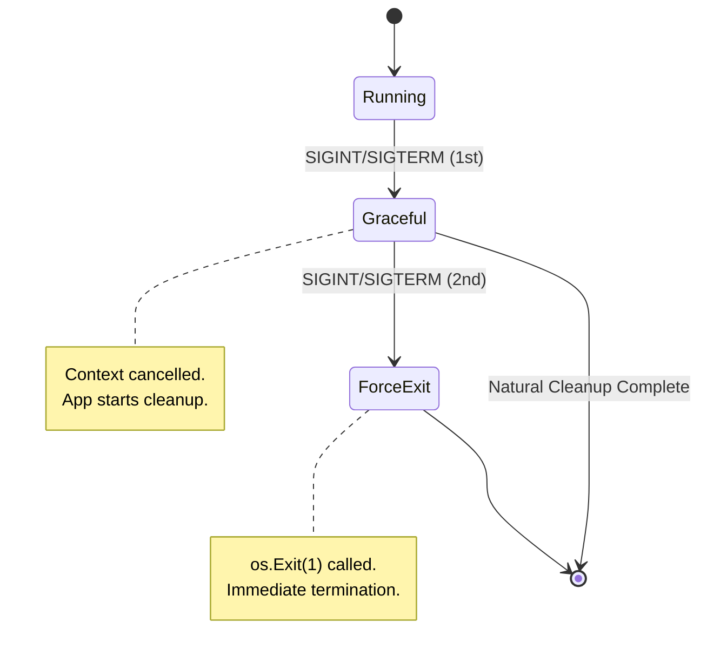
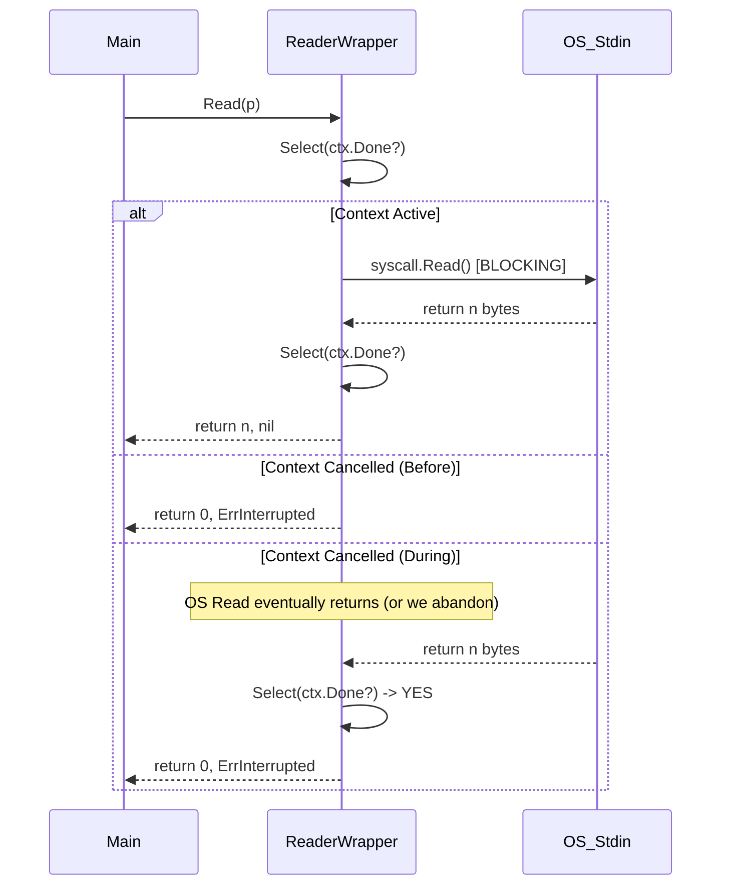

# Technical Architecture

## Overview

`lifecycle` manages the interaction between OS signals, Context cancellation, and blocking I/O calls.

## Patterns

### 1. Robust Signal Context (`pkg/signal`)

Our `SignalContext` manages the transition from Graceful to Forced shutdown, essential for interactive CLIs.

**Key Features:**

* **Functional Options**: Customize if `SIGINT` cancels or the number of signals for `ForceExit`.
* **Zero Leak**: monitoring goroutine is cleaned up via `.Stop()`.

### 2. Interruptible I/O (`pkg/termio`)

Go's `io.Reader` is blocking. We cannot easily kill a thread blocked on a syscall. `InterruptibleReader` solves this by using a "Peek & Abandon" strategy.

#### Caveats & Constraints

* **Data Loss (Peek & Abandon)**: If a read returns exactly as the context is cancelled, the bytes consumed from the OS buffer are **discarded** to prioritize the error. This is acceptable for interactive CLIs but risky for binary streams.
* **Blocking Syscalls**: Go cannot interrupt a raw `read()` syscall. The `Reader` remains blocked in the OS until data arrives, even if the user receives `ErrInterrupted`.
* **Buffer Inconsistency**: Sharing the underlying `io.Reader` between multiple `InterruptibleReader` instances leads to non-deterministic data theft.

### 3. Process Hygiene (`pkg/proc`)

Ensures that child processes do not outlive the parent (preventing "Zombies"), essential for managing Language Servers or background tools. We follow a **Fail-Closed** principle: if a process cannot be safely managed by the OS hygiene (e.g., job assignment failure), it is immediately killed to prevent leaks.

* **Linux**: Uses `SysProcAttr.Pdeathsig` to signal the child when the parent thread dies.
* **Windows**: Uses **Job Objects** (`JOB_OBJECT_LIMIT_KILL_ON_JOB_CLOSE`) to ensure the OS terminates the child tree when the parent handle is closed.

### 4. Runtime Management (`pkg/runtime`)

Ensures process lifecycle is deterministic.

* **Timeouts**: `BlockWithTimeout` enforces deadlines on Shutdown phases. This prevents "Cleanup Zombie" states where a CLI hangs forever waiting for a database close or log flush.

### 5. Observability (`pkg/log` & `pkg/metrics`)

The library is instrumented for production visibility without external dependencies.

* **Structured Logging**: Uses Go 1.21 `slog`. Users can inject custom loggers via `lifecycle.SetLogger`.
* **Decoupled Metrics**: A `Provider` interface allows users to bridge lifecycle events (signals, process starts, terminal upgrades) to Prometheus or OTEL without the library needing to import their SDKs.
* **LogProvider**: Special provider that redirects metrics to debug logs for local verification.

## Windows `CONIN$`

On **Windows**, `os.Stdin` is a wrapper around a Handle. If that Handle is in a blocking Read, standard Windows signals might not propagate correctly to the Go runtime in console applications.
Using `CONIN$` ensures we are talking directly to the Console Input buffer, which allows `Ctrl+C` events to bypass the blocking Read and trigger the `pkg/signal` handler.
