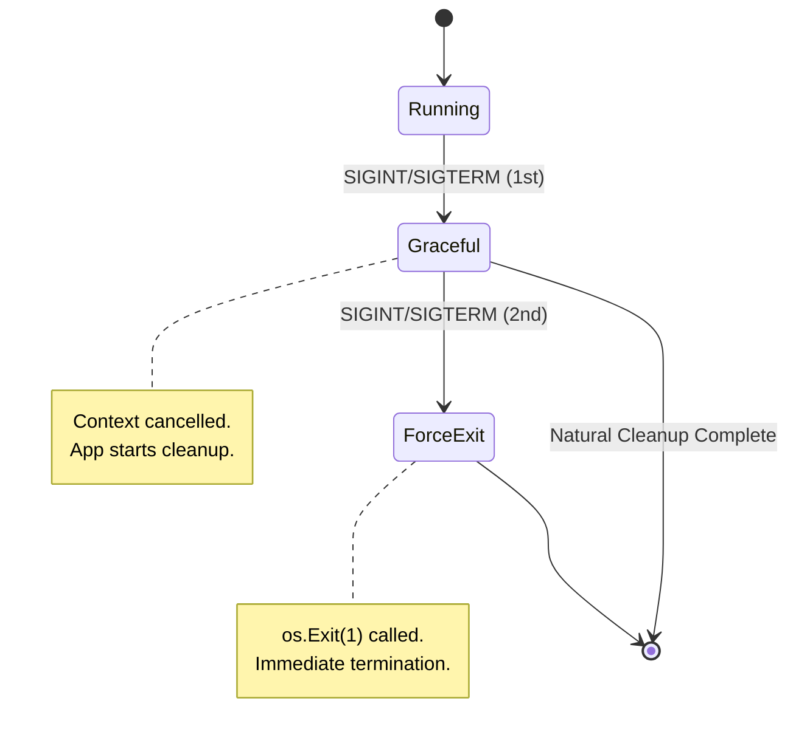
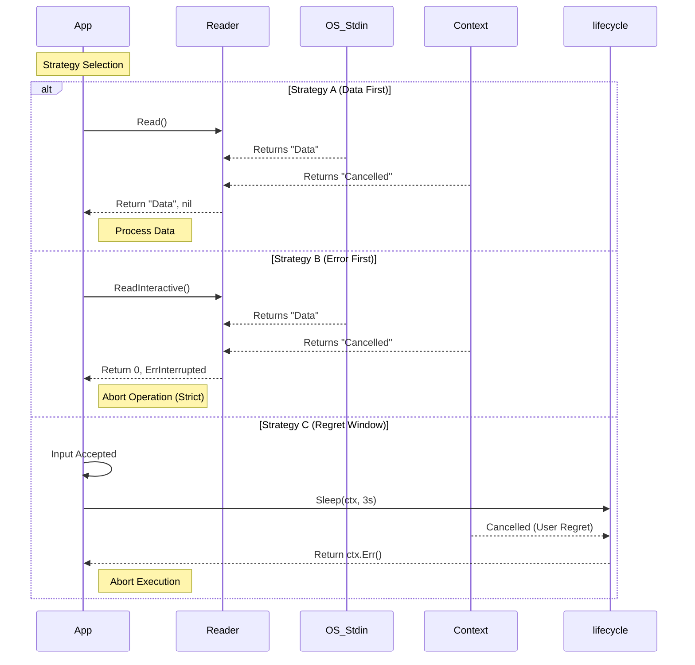
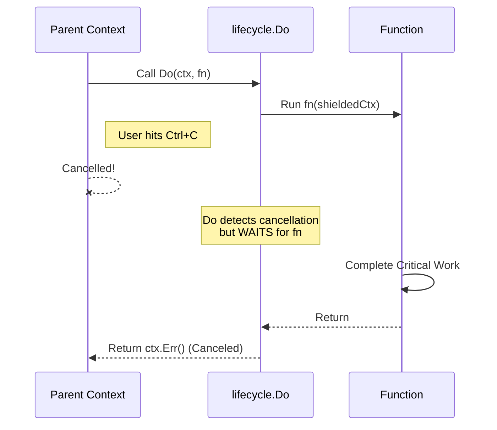
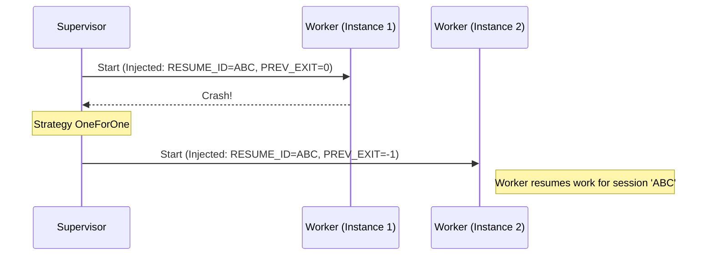
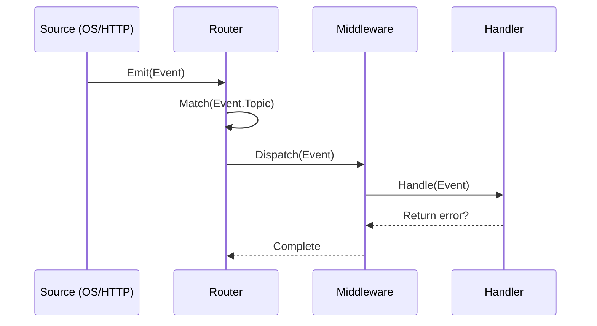

# Technical Architecture

> **Note**: This document describes the architecture of `lifecycle`, spanning its **v1.x Foundation** (Death Management) and the **v2.x Control Plane** (Life Management).

## Table of Contents

* [**I. The Bedrock (v1.x Foundation)**](#i-the-bedrock-v1x-foundation)

    1. [Formal Definition](#1-formal-definition-identity)
    2. [Design Principles](#2-design-principles-constraints)

* [**II. Core Mechanics (Death Management)**](#ii-core-mechanics-death-management)

    3. [Signal State Machine](#3-signal-state-machine)
    4. [Context-Aware I/O](#4-context-aware-io--safety)
    5. [Process Hygiene](#5-process-hygiene)
    6. [Reliability Primitives (v1.4)](#6-reliability-primitives-v14)

* [**III. The Supervisor Pattern (The Bridge)**](#iii-the-supervisor-pattern-the-bridge)

    7. [Worker Protocol](#7-worker-protocol)
    8. [Supervision Tree](#8-supervision-tree)
    9. [Handover Protocol](#9-handover-protocol)

* [**IV. The Control Plane (v2.x Vision)**](#iv-the-control-plane-v2x-vision)

    10. [Event Router](#10-event-router-source---handler)
    11. [Managed Concurrency](#11-managed-concurrency-lifecyclegroup)

* [**V. Ecosystem & Operations**](#v-ecosystem--operations)

    12. [Introspection & Visualization](#12-introspection--visualization)
    13. [Observability](#13-observability)

---

## I. The Bedrock (v1.x Foundation)

This section defines the architectural pillars that govern the library.

### 1. Formal Definition (Identity)

Technically, `lifecycle` is a **Signal-Aware Control Plane** and **Interruptible I/O Supervisor** for modern applications (Services, Agents, CLIs).

* **Signal-Aware**: It allows the application to distinguish between "User Requests" (`SIGINT`) and "System Demands" (`SIGTERM`), enabling intelligent shutdown policies (e.g., "Press Ctrl+C again to force quit").
* **Interruptible**: It creates a layer over blocking System Calls (like `read`), allowing them to be abandoned instantly via Context cancellation, preventing goroutine leaks.
* **Supervisor**: It manages the lifecycle of child components (Processes, Containers, Goroutines), ensuring they are bound to the parent's lifetime.

### 2. Design Principles (Constraints)

To prevent "Memory Leaks" and "Zombie Processes", the system imposes explicit constraints:

#### 2.1. Managed Global State

We acknowledge that OS signals are inherently global. Instead of pretending they aren't, `lifecycle` **manages** this global state for you.

* **Default Router**: Like `net/http`, we provide a default multiplexer for ease of use.
* **Clean Logic**: Your business logic remains free of global side-effects, relying on `Context` propagation and `Handler` interfaces.

#### 2.2. Fail-Closed Hygiene

We adopt a **Fail-Closed** default for child processes.
If the parent process crashes or is killed (`SIGKILL`), all child processes must die immediately. This is enforced via OS primitives on supported platforms:

* **Linux**: `SysProcAttr.Pdeathsig`
* **Windows**: Job Objects (`JOB_OBJECT_LIMIT_KILL_ON_JOB_CLOSE`)
* **macOS/BSD**: *Not supported* (Best-effort cleanup via Signals only).

#### 2.3. Platform Agnosticism (Windows First)

Windows is a first-class citizen.

* We explicitly handle `CONIN$` to ensure `Ctrl+C` works reliably in interactive prompts.
* We normalize file system paths and signals to ensure behavior matches Unix expectations where possible.

#### 2.4. Observability by Default

Internal state changes are not black boxes. They are exposed via:

* **Metrics**: Counts and Histograms for every signal, hook, and I/O event.
* **Introspection**: Immutable `State()` methods that allow the application to visualize its own topology.

---

## II. Core Mechanics (Death Management)

This section details the internal state machines and I/O handling strategies.

### 3. Signal State Machine

Our `SignalContext` manages the transition from **Graceful** to **Forced** shutdown.



**Key Behaviors:**

* **Async Hooks**: `OnShutdown` hooks run concurrently or sequentially (LIFO) depending on configuration, but always *after* context cancellation.
* **Reasoning**: `ctx.Reason()` differentiates if closure was manual (`Stop()`), signal-based (`Interrupt`), or time-based (`Timeout`).

#### Execution Flow

```mermaid
sequenceDiagram
    participant OS
    participant SignalContext
    participant Hook_B
    participant Hook_A
    participant App

    OS->>SignalContext: SIGTERM
    SignalContext->>App: Cancel Context (ctx.Done closed)
    
    rect rgb(30, 30, 30)
        note right of SignalContext: Async Cleanup (LIFO)
        SignalContext->>Hook_B: Execute()
        Hook_B-->>SignalContext: Return
        SignalContext->>Hook_A: Execute()
        Hook_A-->>SignalContext: Return (or Panic recovered)
    end
```



### 4. Context-Aware I/O & Safety

Traditional I/O is binary: it reads or blocks. `lifecycle` introduces **Context-Aware I/O** to balance Data vs. Safety.

| Strategy | Use Case | Behavior |
| :--- | :--- | :--- |
| **Shielded Return** | Automation / Logs | **Data First**. If data arrives with Cancel, return Data. |
| **Strict Discard** | Interactive Prompts | **Safety First**. If Cancel occurs, discard partial input. |
| **Regret Window** | Critical Opps | **Pause**. `Sleep(ctx)` breaks availability on Cancel. |



### 5. Process Hygiene

Ensures child processes do not outlive the parent.

* **Linux**: Uses `SysProcAttr.Pdeathsig` to signal the child when the parent thread dies.
* **Windows**: Uses **Job Objects** (`JOB_OBJECT_LIMIT_KILL_ON_JOB_CLOSE`) to ensure the OS terminates the child tree when the parent handle is closed.
* **macOS**: Fallback to standard `exec.Cmd`. No OS-level guarantee against zombies on hard crashes.

### 6. Reliability Primitives (v1.4)

To support **Durable Execution** engines (like Trellis), we provide primitives that shield critical operations.

#### Critical Sections (`lifecycle.Do`)

`lifecycle.Do(ctx, fn)` allows executing a function that *cannot be cancelled* by the parent context until it completes.



---

## III. The Supervisor Pattern (The Bridge)

(Introduced in v1.3)
The Supervisor manages a set of Workers, forming a **Supervision Tree**.

### 7. Worker Protocol

Uniform interface for `Process`, `Container`, and `Goroutine` management.

```mermaid
sequenceDiagram
    participant Manager
    participant Worker
    
    Manager->>Worker: Start(ctx)
    activate Worker
    
    rect rgb(30, 30, 30)
        note right of Worker: Work happens...
    end

    alt Graceful Stop
        Manager->>Worker: Stop(ctx)
        Worker-->>Manager: Returns nil
    else Crash
        Worker->>Worker: Closes Wait() channel (w/ error)
    end
    deactivate Worker
```



### 8. Supervision Tree

* **OneForOne**: Restart only the failed child.
* **OneForAll**: Restart all children if one fails (tight coupling).
* **Backoff**: Exponential backoff (with jitter) limits restart loops.

### 9. Handover Protocol

Allows "Durable Execution" across restarts.
The Supervisor injects environment variables into the restarted worker:

* `LIFECYCLE_RESUME_ID`: Stable UUID for the worker session.
* `LIFECYCLE_PREV_EXIT`: Exit code of the previous run.



---

## IV. The Control Plane (v2.x Vision)

(Introduced in v2.0)
The Control Plane generalized the "Signal" concept into generic "Events".

### 10. Event Router (Source -> Handler)

The `Router` is the central nervous system of the Control Plane, inspired by `net/http.ServeMux`. It routes generalized `Events` to specialized `Handlers`.

> **Note (Facade)**: The router and handlers are exposed via the top-level `lifecycle` package for ease of use (e.g., `lifecycle.NewRouter()`).

#### 10.1. Mux-Style Pattern Matching

Routes are defined using string patterns. We support:

* **Exact Match**: `"webhook/reload"`
* **Glob Match**: `"signal.*"` (using `path.Match`)

```go
router.HandleFunc("signal.*", func(ctx context.Context, e Event) error {
    log.Println("Received signal:", e)
    return nil
})
```

#### 10.2. Middleware Chains

Middleware wraps handlers to provide cross-cutting concerns (logging, recovery, tracing).

```go
router.Use(RecoveryMiddleware)
router.Use(LoggingMiddleware)
```

#### 10.3. Execution Flow



### 11. Managed Concurrency (`lifecycle.Group`)

To adhere to **Zero Global State**, we avoid global goroutine tracking. Instead, we provide `lifecycle.Group` (similar to `errgroup.Group`) with added safety and observability.

```go
g, ctx := lifecycle.NewGroup(mainCtx)
g.Go(func(ctx context.Context) error {
    // ... work ...
    return nil
})
g.Wait()
```

**Features:**

* **Panic Recovery**: Panics are recovered, logged with stack traces, and returned as errors to cancel the group.
* **Auto-Observability**: Active goroutines are tracked in metrics (`lifecycle_goroutines_started_total`).
* **Concurrency Limits**: `g.SetLimit(n)` prevents resource exhaustion.

---

## V. Ecosystem & Operations

### 12. Introspection & Visualization

We adopt the **Introspection Pattern**: components expose `State()` methods returning immutable DTOs, which are rendered into diagrams.

* **Logic/FSM**: Rendered as `stateDiagram-v2`.
* **Topology**: Rendered as `graph TD`.

**Status Palette:**

* 🟡 **Pending**: Defined, not active.
* 🔵 **Running**: Active & healthy.
* 🟢 **Stopped**: Clean exit.
* 🔴 **Failed**: Crashed/Error.

### 13. Observability

The library is instrumented via `pkg/metrics` and `pkg/log`.

* **Signals**: `IncSignalReceived`
* **Processes**: `IncProcessStarted`, `IncProcessFailed`
* **Hooks**: `ObserveHookDuration`
* **Data Safety**: `IncTerminalUpgrade` (Windows `CONIN$` usage)
