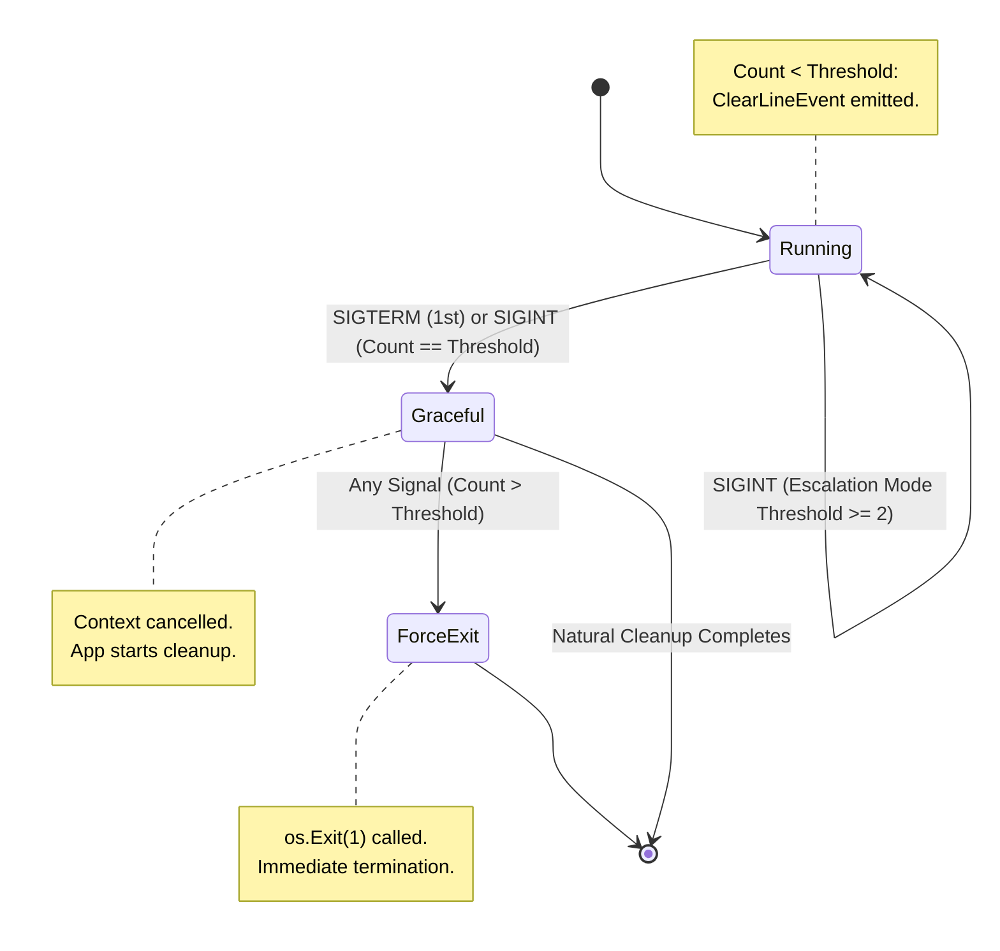
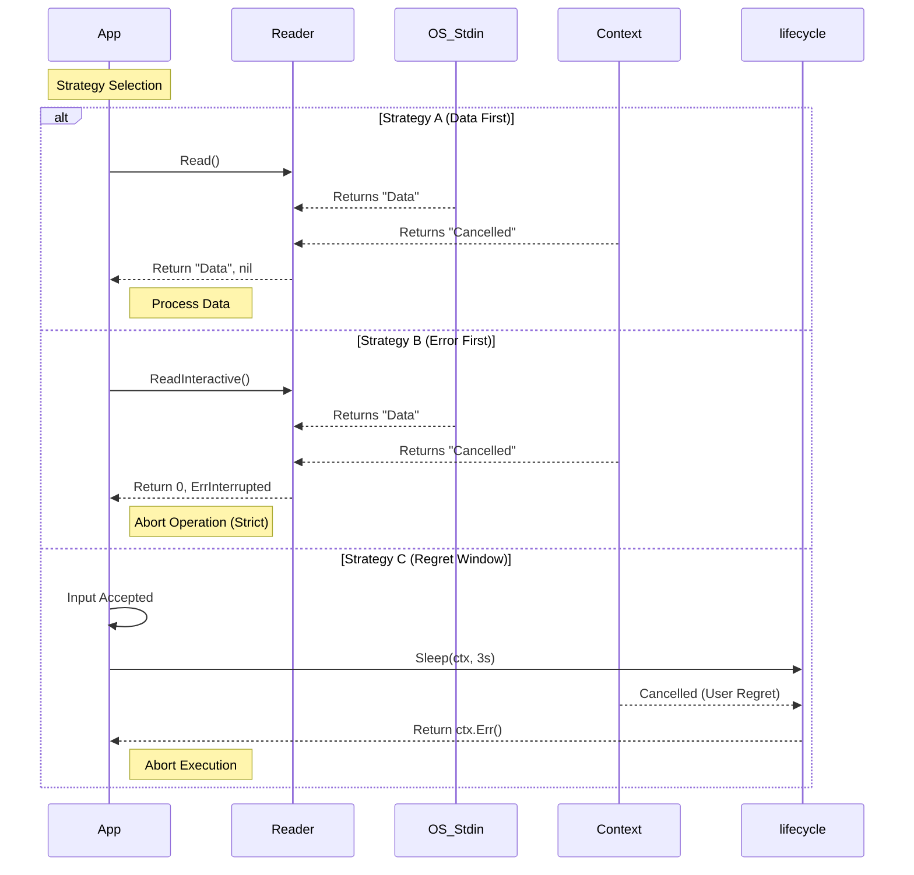
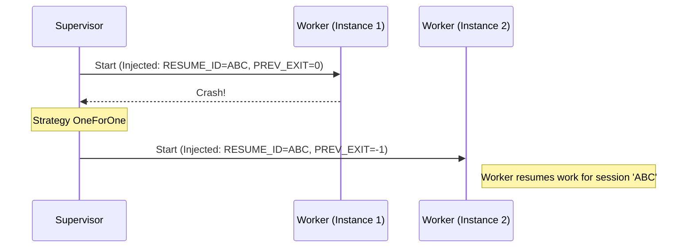
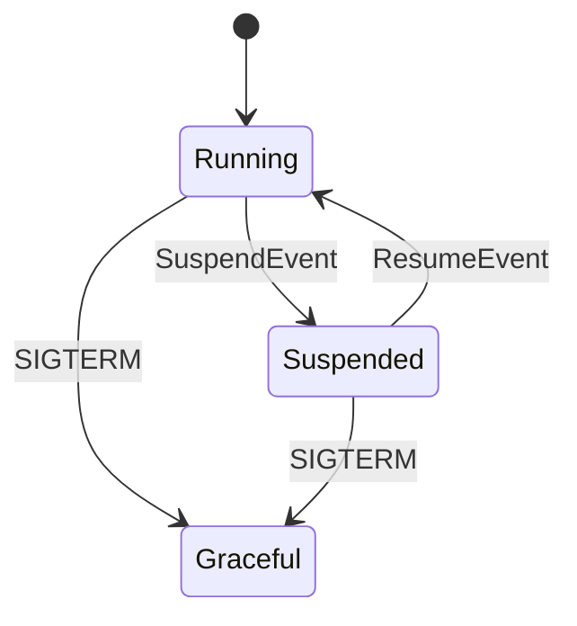
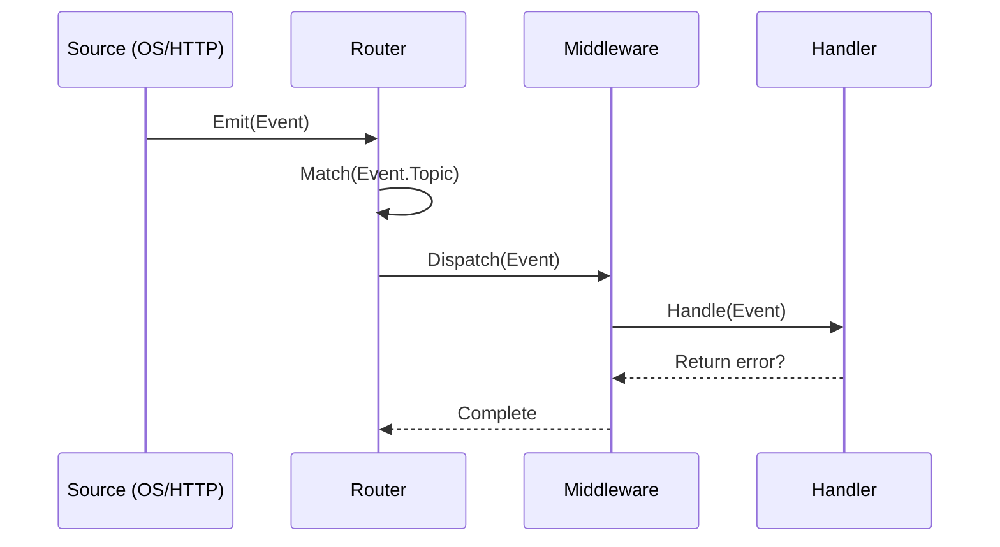

# Technical Architecture

> **Note**: This document describes the architecture of `lifecycle`, spanning its **v1.0-v1.4 Foundation** (Death Management) and the **v1.5+ Control Plane** (Life Management).
> For a history of architectural choices, see **[DECISIONS.md](DECISIONS.md)**.

## Table of Contents

* [**I. The Bedrock (v1.0-v1.4 Foundation)**](#i-the-bedrock-v10-v14-foundation)

    1. [Formal Definition](#1-formal-definition-identity)
    2. [Design Principles](#2-design-principles-constraints)

* [**II. Core Mechanics (Death Management)**](#ii-core-mechanics-death-management)

    3. [Signal State Machine](#3-signal-state-machine)
    4. [Context-Aware I/O](#4-context-aware-io--safety)
    5. [Managed Concurrency (v1.5)](#5-managed-concurrency-v15)
    6. [Process Hygiene](#6-process-hygiene-powered-by-procio)
    7. [Reliability Primitives (v1.4)](#7-reliability-primitives-v14)

* [**III. The Supervisor Pattern (The Bridge)**](#iii-the-supervisor-pattern-the-bridge)

    8. [Worker Protocol](#8-worker-protocol)
    9. [Supervision Tree](#9-supervision-tree)
    10. [Handover Protocol](#10-handover-protocol)

* [**IV. The Control Plane (v1.5+)**](#iv-the-control-plane-v15)

    11. [Event Router](#11-event-router-source---handler)
    12. [Managed Concurrency](#12-managed-concurrency-lifecyclego)

* [**V. Ecosystem & Operations**](#v-ecosystem--operations)

13. [Introspection & Visualization](#13-introspection--visualization)
14. [Observability](#14-observability)

* [**VI. Quality & Reliability**](#vi-quality--reliability)

15. [Honest Coverage Philosophy](#15-honest-coverage-philosophy)
16. [Coverage Rigidity vs. Reality](#16-coverage-rigidity-vs-reality)

---

## I. The Bedrock (v1.0-v1.4 Foundation)

This section defines the architectural pillars that govern the library.

> **Architecture Note (Facade Pattern)**:
> The root `lifecycle` package acts as a **Facade**, exposing a curated subset of functionality from `pkg/core` and `pkg/events` for 90% of use cases.
> Deep consumers should import from the core packages directly, while application authors should prefer the root package for ergonomics.
> Tests in `lifecycle_test.go` verify this wiring but do not duplicate the exhaustive behavioral tests found in the core packages.

### 1. Formal Definition (Identity)

Technically, `lifecycle` is a **Signal-Aware Control Plane** and **Interruptible I/O Supervisor** for modern applications (Services, Agents, CLIs).

* **Signal-Aware**: It allows the application to distinguish between "User Requests" (`SIGINT`) and "System Demands" (`SIGTERM`), enabling intelligent shutdown policies (e.g., "Press Ctrl+C again to force quit").
* **Interruptible**: It creates a layer over blocking System Calls (like `read`), allowing them to be abandoned instantly via Context cancellation, preventing goroutine leaks.
* **Supervisor**: It manages the lifecycle of child components (Processes, Containers, Goroutines), ensuring they are bound to the parent's lifetime.

### 2. Design Principles (Constraints)

To prevent "Memory Leaks" and "Zombie Processes", the system imposes explicit constraints:

#### 2.1. Managed Global State

We acknowledge that OS signals are inherently global. Instead of pretending they aren't, `lifecycle` **manages** this global state for you.

* **Default Router**: Like `net/http`, we provide a default multiplexer for ease of use.
* **Clean Logic**: Your business logic remains free of global side-effects, relying on `Context` propagation and `Handler` interfaces.

#### 2.2. Fail-Closed Hygiene

We adopt a **Fail-Closed** default for child processes.
If the parent process crashes or is killed (`SIGKILL`), all child processes must die immediately. This is enforced via OS primitives on supported platforms:

* **Linux**: `SysProcAttr.Pdeathsig`
* **Windows**: Job Objects (`JOB_OBJECT_LIMIT_KILL_ON_JOB_CLOSE`)
* **macOS/BSD**: *Not supported* (Best-effort cleanup via Signals only).

#### 2.3. Platform Agnosticism (Windows First)

Windows is a first-class citizen.

* We explicitly handle `CONIN$` to ensure `Ctrl+C` works reliably in interactive prompts.
* We normalize file system paths and signals to ensure behavior matches Unix expectations where possible.

#### 2.4. Observability by Default

Internal state changes are not black boxes. They are exposed via:

* **Metrics**: Counts and Histograms for every signal, hook, and I/O event.
* **Introspection**: Immutable `State()` methods that allow the application to visualize its own topology.

#### 2.5. Main-Driven Shutdown

The lifecycle is bound to the **Main Job** (`lifecycle.Run(fn)`). When the main function returns, the application is considered **Complete**. `lifecycle` automatically cancels the Global Context, signaling all background tasks (`lifecycle.Go`, `Supervisor`) to shut down immediately. This prevents "Orphaned Processes" where a finished CLI tool hangs indefinitely waiting for a metrics reporter.

#### 2.6. Pragmatic Composition over Monoliths

We believe in **Simple Primitives, Rich Behaviors**. Instead of a monolithic "Exit" function with 20 flags, we provide atomic events (`Suspend`, `Resume`, `Shutdown`, `Reload`) that can be chained.

* **Composition is King**: A "Power Command" (like `x` or `terminate`) is simply a sequence: `SuspendEvent` (to ensure state is saved) followed by a `ShutdownEvent`.
* **Context Cancellation is Normal**: During shutdown, receiving `context.Canceled` is not an "Error" to be warned about. It is the sign of a healthy, responding system fulfilling its contract.

---

## II. Core Mechanics (Death Management)

This section details the internal state machines and I/O handling strategies.

### 3. Signal State Machine

Our `SignalContext` manages the transition from **Graceful** to **Forced** shutdown based on a configurable **Force-Exit Threshold**.



**Key Behaviors:**

* **Mode: Industry Standard (Threshold=1)**: The first `SIGINT` (Ctrl+C) or `SIGTERM` cancels the context. The second signal triggers `os.Exit(1)`. This is the default.
* **Mode: Escalation (Threshold=N)**: `SIGINT` is captured and emitted as an event (`InterruptEvent`) without cancelling the context. Only the N-th signal triggers `os.Exit(1)`. `SIGTERM` always cancels on the first signal.
* **Interactive Offset**: If `WithCancelOnInterrupt(false)` is set, the runtime implicitly increments the threshold by 2. This preserves the "Distance Invariant" (Kill distance relative to the last software action) and prevents races during interactive shutdowns.
* **Mode: Unsafe (Threshold=0)**: Automatic forced exit is disabled. The user is responsible for process status.
* **Async Hooks**: `OnShutdown` hooks run concurrently or sequentially (LIFO) depending on configuration, but always *after* context cancellation.
* **Reasoning**: `ctx.Reason()` differentiates if closure was manual (`Stop()`), signal-based (`Interrupt`), or time-based (`Timeout`).
* **Shutdown Diagnostics**: If cleanup exceeded `WithShutdownTimeout` (default 2s), the runtime automatically dumps all goroutine stacks to `stderr` to help diagnose hangs.

#### Execution Flow

```mermaid
sequenceDiagram
    participant OS
    participant SignalContext
    participant Hook_B
    participant Hook_A
    participant App

    OS->>SignalContext: SIGTERM
    SignalContext->>App: Cancel Context (ctx.Done closed)
    
    rect rgb(30, 30, 30)
        note right of SignalContext: Async Cleanup (LIFO)
        SignalContext->>Hook_B: Execute()
        Hook_B-->>SignalContext: Return
        SignalContext->>Hook_A: Execute()
        Hook_A-->>SignalContext: Return (or Panic recovered)
    end
```



### 4. Context-Aware I/O & Safety

Traditional I/O is binary: it reads or blocks. `lifecycle` (via **`procio/termio`**) introduces **Context-Aware I/O** to balance Data vs. Safety.

| Strategy | Use Case | Behavior |
| :--- | :--- | :--- |
| **Shielded Return** | Automation / Logs | **Data First**. If data arrives with Cancel, return Data. |
| **Strict Discard** | Interactive Prompts | **Safety First**. If Cancel occurs, discard partial input. |
| **Regret Window** | Critical Opps | **Pause**. `Sleep(ctx)` breaks availability on Cancel. |



### 5. Managed Concurrency (v1.5)

`lifecycle` provides primitives to manage goroutines safely, ensuring they respect shutdown signals and provide visibility.

#### A. Scoped Execution (`lifecycle.Go`)

The most common pattern. Fire-and-forget but tracked.

* **Context Propagation**: Inherits cancellation from the parent.
* **Wait Tracking**: `lifecycle.Run` automatically waits for these tasks.
* **Safety**: Panics are recovered and logged.

```go
lifecycle.Run(func(ctx context.Context) error {
    lifecycle.Go(ctx, func(ctx context.Context) error {
        // Runs in background, but tracked.
        // If it panics, app stays alive.
        return nil
    })
    return nil
})
```

#### B. Safe Executor (`lifecycle.Do`)

Executes a function *synchronously* with safety guarantees.

* **Observability**: Metrics for duration and success/failure.
* **Recovery**: Captures panics.
* **Usage**: Used internally by `Go` and `Group`.

#### C. Structured Group (`lifecycle.Group`)

For complex parallelism requiring limits or gang-scheduling.

* **API**: Wrapper around `errgroup.Group`.
* **Features**: `SetLimit(n)`, panic recovery, and metric tracking.

```go
g, ctx := lifecycle.NewGroup(ctx)
g.SetLimit(10)
g.Go(func(ctx context.Context) error { ... })
g.Wait()
```

### 6. Process Hygiene (Powered by `procio`)

Ensures child processes do not outlive the parent. This logic is delegated to the **[procio](https://github.com/aretw0/procio)** library.

* **Linux**: Uses `SysProcAttr.Pdeathsig` to signal the child when the parent thread dies.
* **Windows**: Uses **Job Objects** (`JOB_OBJECT_LIMIT_KILL_ON_JOB_CLOSE`) to ensure the OS terminates the child tree when the parent handle is closed.
* **macOS**: Fallback to standard `exec.Cmd` (OS limitations prevent strict guarantees).

### 7. Reliability Primitives (v1.4)

To support **Durable Execution** engines (like Trellis), we provide primitives that shield critical operations.

#### Critical Sections (`lifecycle.DoDetached`)

`lifecycle.DoDetached(ctx, fn)` (formerly `Do`) allows executing a function that *cannot be cancelled* by the parent context until it completes. It returns any error produced by the shielded function.

> **Note:** `lifecycle.Do(ctx, fn)` now represents a "Safe Executor" that respects cancellation but provides panic recovery and observability. `DoDetached` wraps `Do` with `context.WithoutCancel`.

 ```mermaid
 sequenceDiagram
     participant P as Parent Context
     participant D as lifecycle.DoDetached
     participant F as Function
     
     P->>D: Call DoDetached(ctx, fn)
     D->>F: Run fn(shieldedCtx) -> error
     
     note right of P: User hits Ctrl+C
     P--xP: Cancelled!
     
     note over D: DoDetached detects cancellation<br/>but WAITS for fn
     
     F->>F: Complete Critical Work
     F-->>D: Return error
     
     D-->>P: Return error (or Canceled if shielded ctx ignored)
 ```

---

## III. The Supervisor Pattern (The Bridge)

(Introduced in v1.3)
The Supervisor manages a set of Workers, forming a **Supervision Tree**.

### 8. Worker Protocol

Uniform interface for `Process`, `Container`, and `Goroutine` management.

```mermaid
sequenceDiagram
    participant Manager
    participant Worker
    
    Manager->>Worker: Start(ctx)
    activate Worker
    
    rect rgb(30, 30, 30)
        note right of Worker: Work happens...
    end

    alt Graceful Stop
        Manager->>Worker: Stop(ctx)
        Worker-->>Manager: Returns nil
    else Crash
        Worker->>Worker: Closes Wait() channel (w/ error)
    end
    deactivate Worker
```



### 9. Supervision Tree

* **OneForOne**: Restart only the failed child.
* **OneForAll**: Restart all children if one fails (tight coupling).
* **Restart Policies**: Per-child control via `Always`, `OnFailure`, or `Never`.
* **Circuit Breaker**: Sliding-window restarts limit (`MaxRestarts` within `MaxDuration`).
* **Backoff**: Exponential backoff (with jitter) limits restart loops.
* **Introspection Metadata**: Supervisors attach reliability metrics to their state:
  * `restarts`: Total restart count for the child.
  * `circuit_breaker`: Set to `triggered` if the max restarts threshold is exceeded.

#### Recursive Introspection

Supervisors can manage other supervisors, forming deep trees. The `State()` method supports recursive inspection by propagating `Children` fields:

```go
rootSup := supervisor.New("root", supervisor.StrategyOneForOne,
    supervisor.Spec{
        Name: "child-sup",
        Factory: func() (worker.Worker, error) {
            return childSup, nil  // Nested supervisor
        },
    },
)

state := rootSup.State()
// state.Children[0].Children = childSup's children ✅
```

This enables full topology visualization in introspection diagrams, showing the complete supervision tree regardless of nesting depth.

#### Worker Identity Shield (Reliability)

To prevent race conditions during rapid failures and restarts (e.g., `OneForAll` strategy), the supervisor implements a **Worker Identity Shield**.

* **The Problem**: In asynchronous environments, an exit event from a *previous* worker instance might arrive after a *new* instance has already been started. Without protection, the supervisor might process this stale event and accidentally shut down or remove the new, healthy worker.
* **The Solution**: Every `childExit` event carries a reference to the specific `worker.Worker` instance that triggered it. The supervisor's monitor loop verifies this identity against the currently active child before taking action. Stale events are logged and ignored.

### 10. Handover Protocol

Allows "Durable Execution" across restarts.
The Supervisor injects environment variables into the restarted worker:

* `LIFECYCLE_RESUME_ID`: Stable UUID for the worker session.
* `LIFECYCLE_PREV_EXIT`: Exit code of the previous run.



---

## IV. The Control Plane (v1.5+)

(Introduced in v1.5)
The Control Plane generalized the "Signal" concept into generic "Events".

### 11. Event Router (Source -> Handler)

The `Router` is the central nervous system of the Control Plane, inspired by `net/http.ServeMux`. It routes generalized `Events` to specialized `Handlers`.

> **Note (Facade)**: The router and handlers are exposed via the top-level `lifecycle` package for ease of use (e.g., `lifecycle.NewRouter()`).

#### 11.1. Mux-Style Pattern Matching

Routes are defined using string patterns. We support:

* **Exact Match**: `"webhook/reload"`
* **Glob Match**: `"signal.*"` (using `path.Match`)

```go
router.HandleFunc("signal.*", func(ctx context.Context, e Event) error {
    log.Println("Received signal:", e)
    return nil
})
```

#### 11.2. Standard Events (Control Plane)

The library provides predefined events for common lifecycle transitions:

| Event | Topic | Trigger | Typical Action |
| :--- | :--- | :--- | :--- |
| `SuspendEvent`  | `lifecycle/suspend`    | Escalation logic / API   | Pause workers, persist state. |
| `ResumeEvent`   | `lifecycle/resume`     | Escalation logic / API   | Resume workers from state.    |
| `ShutdownEvent` | `lifecycle/shutdown`   | Input: `exit`, `quit`    | Cancel `SignalContext`.       |
| `TerminateEvent`| `lifecycle/terminate`  | Input: `x`, `terminate`  | Suspend (Save) + Shutdown.    |
| `ClearLineEvent`| `lifecycle/clear-line` | Ctrl+C Escalation Mode   | Clear CLI prompt, re-print `>`.|
| `UnknownCommandEvent`| `input/unknown`   | Input: `?`, `unknown`    | Print generic help message.   |

#### 11.3. Middleware Chains

Middleware wraps handlers to provide cross-cutting concerns (logging, recovery, tracing).

```go
router.Use(RecoveryMiddleware)
router.Use(LoggingMiddleware)
```

#### 11.4. Idempotent Handlers (Once)

Events might be triggered multiple times (e.g., a "Quit" signal followed by a manual "Exit" command). To prevent side-effects like double-closing channels, `lifecycle` provides the `control.Once(handler)` middleware.

This utility ensures the wrapped handler's logic is executed **exactly once**, providing a standard safety mechanism for shutdown and cleanup operations.

```go
// Protected shutdown logic
quitHandler := control.Once(control.HandlerFunc(func(ctx context.Context, _ control.Event) error {
    close(quitCh) // Safe against multiple calls
    return nil
}))
```

#### 11.5. Introspection

The Router exposes registered routes and its own status via the `Introspectable` interface.

```go
type Introspectable interface {
    State() any
}
```

Calls to `State()` return a snapshot of the component's internal state (topology, metrics, flags) for visualization tools.

```go
state := router.State().(RouterState)
// {Routes: [...], Middlewares: 2, Running: true}
```

#### 11.6. Suspend & Resume (Durable Execution)

To support **Durable Execution systems**, `lifecycle` introduces `SuspendEvent` and `ResumeEvent` managed by `handlers.SuspendHandler`.



* **Suspend**: Application is asked to pause processing, persist state, and stop accepting new work.
* **Resume**: Application restarts processing from the persisted state.
* **Transitioning State**: The `SuspendHandler` uses an internal `transitioning` flag to ensure that while hooks are running, duplicate events (e.g., rapid-fire suspend signals) are ignored. This prevents race conditions and ensures hook execution is atomic.
* **Idempotency**: Requests to `Suspend` while already suspended (or `Resume` while running) are ignored safely.
* **Quiescence Safety**: The `SuspendGate` primitive is context-aware, ensuring buffered workers can abort instantly if the application shuts down while they are paused.

#### 11.6.1. Sequential Execution & Ordering (FIFO)

The `SuspendHandler` (and most `control.Router` logic) executes hooks **sequentially** in the order they were registered. This has critical implications for UI feedback:

* **The Problem**: If a UI hook ("System Suspended") is registered *before* a heavy worker (e.g., a Supervisor with a slow `Blocker`), the UI will announce success immediately, while the system is still technically in transition.
* **The Solution (Registration Hierarchy)**: To ensure "Final State" messages are accurate, register heavy components (Supervisors/Gateways) **before** UI reporting hooks.

```go
// Correct Order:
suspendHandler.Manage(supervisor)              // 1. Heavy lifting (blocking)
suspendHandler.OnSuspend(func(...) {           // 2. UI feedback (runs after #1)
    fmt.Println("🛑 SYSTEM SUSPENDED")
})
```

#### 11.7. Execution Flow



#### 11.8. Interactive Router Preset

To reduce boilerplate for CLI applications, `lifecycle` provides a pre-configured router helper.

```go
// wires up:
// - OS Signals (Interrupt/Term) -> Escalator (Interrupt first, then Quit)
// - Input (Stdin) -> Router (reads lines as commands)
// - Commands: "suspend", "resume" -> SuspendHandler
// - Command: "quit", "q" -> shutdownFunc
router := lifecycle.NewInteractiveRouter(
    lifecycle.WithSuspendOnInterrupt(suspendHandler),
    lifecycle.WithShutdown(func() { ... }),
)
```

This helper ensures standard behavior ("q" to quit, "Ctrl+C" to suspend first) without manual wiring.

#### 11.9. Source Helper Pattern (BaseSource)

To reduce boilerplate across source implementations, `lifecycle` provides `BaseSource` — an embeddable helper following the same pattern as `BaseWorker`.

**Problem**: 7 source types repeated identical `Events()` method implementation.

**Solution**: Embedding pattern with auto-exposed methods.

**Before** (per source):

```go
type MySource struct {
    events chan control.Event  // Repeated
}

func NewMySource() *MySource {
    return &MySource{
        events: make(chan control.Event, 10),  // Repeated
    }
}

func (s *MySource) Events() <-chan control.Event {  // Repeated
    return s.events
}

func (s *MySource) Start(ctx context.Context) error {
    s.events <- event  // Direct access
}
```

**After** (with BaseSource):

```go
type MySource struct {
    control.BaseSource  // Embedding!
}

func NewMySource() *MySource {
    return &MySource{
        BaseSource: control.NewBaseSource(10),  // Explicit buffer
    }
}

// Events() FREE via embedding!

func (s *MySource) Start(ctx context.Context) error {
    s.Emit(event)  // Clean helper
}
```

**Benefits**:

* **DRY**: Single implementation, not repeated 7x
* **Consistency**: All sources use same pattern
* **Explicit**: Buffer size visible at construction
* **Future-Proof**: Add features (metrics, filtering) in one place

**API**:

```go
func NewBaseSource(bufferSize int) BaseSource
func (b *BaseSource) Events() <-chan Event  // Auto via embedding
func (b *BaseSource) Emit(e Event)           // Helper
func (b *BaseSource) Close()                 // Cleanup
```

**Usage**: FileWatchSource, WebhookSource, TickerSource, InputSource, HealthCheckSource, ChannelSource, OSSignalSource.

### 12. Managed Concurrency (`lifecycle.Go`)

To adhere to **Zero Config** but safe concurrency, we use **Context Propagation**.

```go
// 1. Run injects a TaskTracker into the context
runtime.Run(func(ctx context.Context) error {
    // 2. Go() uses the tracker from the context
    runtime.Go(ctx, func(ctx context.Context) error {
        // ... safe background work ...
        return nil
    })
    return nil
})
```

**Features:**

* **Context-Aware**: `Go` looks for a tracker in `ctx`. If found, it tracks the goroutine via `lifecycle.Run`.
* **Safe Fallback**: If `Run` is not used, `Go` falls back to a global tracker. You can wait for these tasks with `lifecycle.WaitForGlobal()`.
* **Leak Prevention**: `Run()` waits for all tracked goroutines to finish before exiting.
* **Panic Recovery**: Panics are caught, logged, and do not crash the main process.

---

## V. Ecosystem & Operations

### 13. Introspection & Visualization

`lifecycle` adopts the **Introspection Pattern**: components expose `State()` methods returning immutable DTOs, which are rendered into **Mermaid diagrams** via the **[github.com/aretw0/introspection](https://github.com/aretw0/introspection)** library.

#### Architecture: Separation of Concerns

Visualization is **delegated** to the external `introspection` library, following the same **Primitive Promotion** strategy used for `procio` (see ADR-0010 and ADR-0011).

* **`lifecycle`** provides **domain-specific styling logic** (`signal.PrimaryStyler`, `worker.NodeLabeler`) and configuration via `LifecycleDiagramConfig()`.
* **`introspection`** handles **structural rendering** (Mermaid syntax, graph traversal, CSS class application).

This separation ensures that:

1. **Diagram logic is DRY**: Rendering logic is not duplicated across `signal`, `worker`, and `supervisor` packages.
2. **Visualization is reusable**: Other projects (e.g., `trellis`, `arbour`) can use `introspection` for their own topologies.
3. **Maintenance is centralized**: Visual improvements or Mermaid syntax changes happen in one place.

#### Diagram Types

* **Logic/FSM**: Rendered via `introspection.StateMachineDiagram` as `stateDiagram-v2`.
* **Topology**: Rendered via `introspection.TreeDiagram` or `introspection.ComponentDiagram` as `graph TD`.

#### Unified System Diagram

The `lifecycle.SystemDiagram(sig, work)` function synthesizes the **Control Plane** (Signal Context) and **Data Plane** (Worker Tree) into a single Mermaid diagram:

```go
diagram := lifecycle.SystemDiagram(ctx.State(), supervisor.State())
```

This delegates to `introspection.ComponentDiagram`, which applies the configuration from `LifecycleDiagramConfig()`.

#### Status Palette (CSS Classes)

The following CSS classes are applied by stylers to represent component states:

* 🟡 **pending**: Defined, not active.
* 🔵 **active**: Running & healthy.
* 🟢 **stopped**: Clean exit.
* 🔴 **failed**: Crashed/Error.

These classes are defined in the domain packages (`pkg/core/signal`, `pkg/core/worker`) and consumed by `introspection` via the `NodeStyler` and `PrimaryStyler` hooks.

For implementation details, see **[docs/ecosystem/introspection.md](ecosystem/introspection.md)**.

### 14. Observability

The library is instrumented via `pkg/metrics` and `pkg/log`.

* **Signals**: `IncSignalReceived`
* **Processes**: `IncProcessStarted`, `IncProcessFailed`
* **Hooks**: `ObserveHookDuration`
* **Data Safety**: `IncTerminalUpgrade` (Windows `CONIN$` usage)

## VI. Quality & Reliability

### 15. Honest Coverage Philosophy

`lifecycle` adopts an **"Honest Coverage"** baseline. Instead of pursuing an arbitrary 100% or even 80% statement coverage across every line of code, we prioritize the verification of **Behavioral Logic** and **Critical Path Resilience**.

We distinguish between two types of code:

* **Primary Behavioral Logic**: The state machines, concurrent primitives, and event routing logic. These must have near-total coverage (effectively 100% of meaningful states).
* **Secondary Plumbing & Syscall Wrappers**: Code that interfaces with OS primitives (e.g., job objects, pdeathsig) or provides boilerplate (NoOp/Mock providers).

### 16. Coverage Rigidity vs. Reality

In certain packages, "100% coverage" often indicates **Test Theater**—tests that exercise no-op paths or force unreachable error states (like mock syscall failures) just to satisfy a metric.

We consider a package "Satisfactory" even with lower metrics if the missing coverage falls into these categories:

* **Unreachable Syscall Errors**: Windows and Linux syscall error paths that only trigger under extreme or non-existent conditions.
* **Boilerplate/NoOp Paths**: Methods in `NoOpProvider` or `LogProvider` that exist for interface compatibility and possess no complex logic.
* **Platform-Specific Mocks**: Code used primarily for testing other components that doesn't hold its own business logic.

By setting an **Honest Baseline**, we ensure that our engineering efforts are spent on validating the reliability of the system, not on maintaining the theater of perfect metrics.
