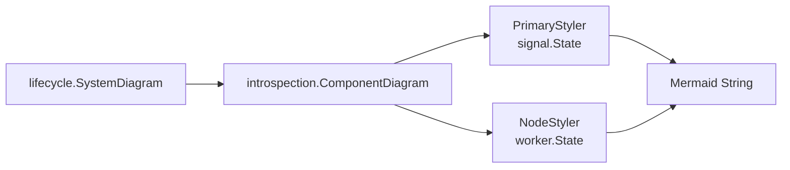

# Ecosystem Analysis: Introspection (Visualization Primitives)

**Introspection** is a standalone Go library that provides generic primitives for visualizing application state using Mermaid diagrams. It was extracted from `lifecycle` to serve as a reusable foundation for any Go project requiring runtime introspection and topology visualization.

## Purpose

`introspection` solves the problem of **coupling visualization logic to domain logic**. Before extraction, each component in `lifecycle` (Signal, Worker, Supervisor) contained custom Mermaid string concatenation, leading to:

- **Redundancy**: Repeated rendering logic across packages.
- **Rigidity**: Changing the visual style required editing multiple files.
- **Testing Burden**: Each package needed separate diagram tests.

By abstracting these concerns into a library, `introspection` provides:

1. **Generic Diagram Builders**: `TreeDiagram`, `StateMachineDiagram`, `ComponentDiagram`.
2. **Customization Hooks**: `NodeStyler`, `NodeLabeler`, `PrimaryStyler`, `PrimaryLabeler`.
3. **Type Safety**: Compile-time guarantees for diagram configuration.

## Current State

- **Version**: `v0.1.2` (Stable)
- **Dependency**: Direct dependency of `lifecycle` (see `go.mod`).
- **Repository**: [github.com/aretw0/introspection](https://github.com/aretw0/introspection)

## Architecture

`lifecycle` delegates all Mermaid rendering to `introspection`:



### Key Responsibilities

| Component | Responsibility |
|-----------|----------------|
| `lifecycle` | Provides domain-specific **styling logic** (`signal.PrimaryStyler`, `worker.NodeLabeler`) and configuration (`LifecycleDiagramConfig`). |
| `introspection` | Handles **structural rendering** (graph syntax, indentation, CSS classes) and generic traversal. |

## Integration Pattern

`lifecycle` uses the **Adapter Pattern** to bridge domain concepts to the visualization engine:

```go
// lifecycle/diagram_config.go
func LifecycleDiagramConfig() *introspection.DiagramConfig {
    return &introspection.DiagramConfig{
        PrimaryID:          "S",
        PrimaryLabel:       "Signal Context",
        PrimaryNodeLabel:   "⚡ Lifecycle Controller",
        SecondaryID:        "root",
        SecondaryLabel:     "Supervision Tree",
        ConnectionLabel:    "governs",
        NodeStyler:         worker.NodeStyler,
        NodeLabeler:        worker.NodeLabeler,
        PrimaryNodeStyler:  signal.PrimaryStyler,
        PrimaryNodeLabeler: signal.PrimaryLabeler,
    }
}

// lifecycle/introspection.go
func SystemDiagram(sig SignalState, work WorkerState) string {
    return introspection.ComponentDiagram(sig, work, LifecycleDiagramConfig())
}
```

## Benefits for `lifecycle`

1. **Separation of Concerns**: Domain logic (lifecycle events, state machines) is decoupled from presentation logic (Mermaid syntax).
2. **Reusability**: Other projects in the ecosystem (e.g., `trellis`, `arbour`) can use `introspection` for their own topologies.
3. **Maintainability**: Diagram bugs or visual improvements are fixed **once** in `introspection`, not scattered across `lifecycle` packages.
4. **Testability**: `introspection` is tested independently with generic test cases, reducing the testing burden on `lifecycle`.

## Example Usage (External Projects)

Any Go project can adopt `introspection` for visualization:

```go
import "github.com/aretw0/introspection"

// Custom domain state
type MyState struct {
    ID     string
    Status string
}

// Custom styler
func MyStyler(state any) string {
    s := state.(MyState)
    if s.Status == "active" {
        return "active"
    }
    return "stopped"
}

// Generate diagram
diagram := introspection.TreeDiagram(rootState, &introspection.TreeConfig{
    RootID:     "root",
    NodeStyler: MyStyler,
})
```

## Roadmap Alignment

The extraction of `introspection` mirrors the successful extraction of **`procio`** (ADR-0010). Both represent **Primitive Promotion**, where foundational logic is elevated to standalone libraries for broader adoption.

## Recommendation

`introspection` should be highlighted as a **Core Dependency** in `lifecycle` documentation, emphasizing that visualization is a **first-class concern** supported by dedicated tooling rather than ad-hoc string manipulation.

## Related

- **ADR-0011**: Introspection Extraction (Primitive Promotion)
- **procio**: Process and I/O primitives (sibling extraction)
- **lifecycle/diagram_config.go**: Domain-to-Library adapter
